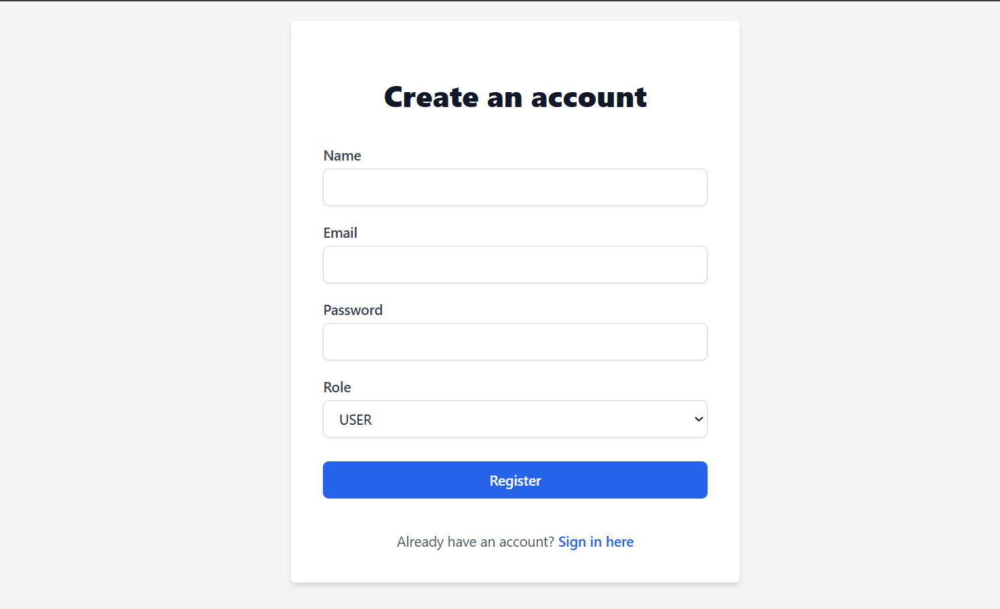
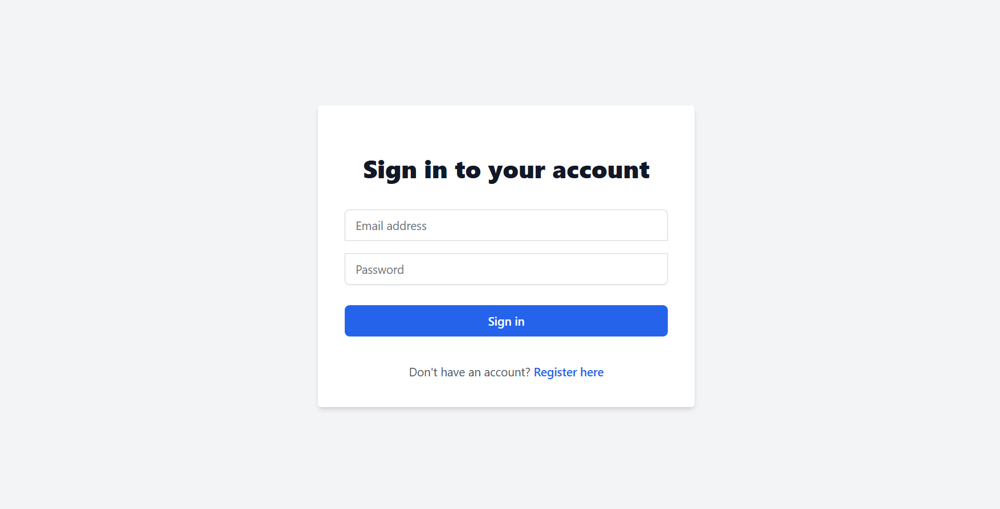
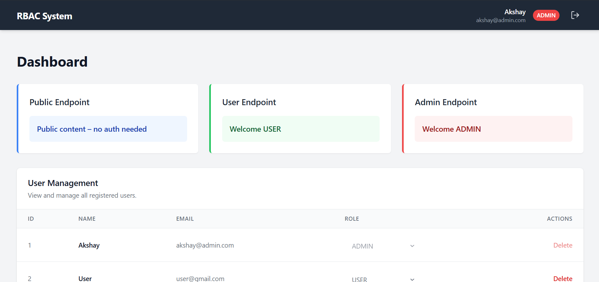
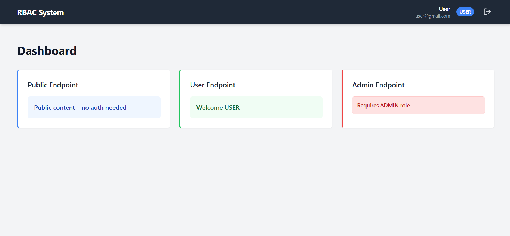

# Full Stack Role-Based Access Control (RBAC) System

Hey there! This is a simple, easy-to-run Full Stack Web Application that authenticates users with JWT (JSON Web Tokens) and restricts their view based on whether they are a normal **USER** or a privileged **ADMIN**. It has securely protected routes on the frontend, and securely protected endpoints via Spring Security on the backend.

## The Tech Stack
- **Backend**: Built completely with Java 17, Spring Boot, Spring Security, JWT, JPA, and an in-memory H2 database
- **Frontend**: Crafted using React 18, TypeScript, Vite, TailwindCSS for styling, and React Hook Form + React Query for interacting with data easily.

---

## How to Run It!

You'll need Java 17+, Node.js 18+, and Maven installed on your machine. No extra database setup is required because the app handles it automatically!

### 1. Start the Backend
Open up a terminal in the root project folder (where this README is), and run:
```bash
mvn clean install
mvn spring-boot:run
```
The backend API is now running at `http://localhost:8080`. 
*Note: You can easily look at and test the API documentation by visiting `http://localhost:8080/swagger-ui.html` on your browser!*

### 2. Start the Frontend
Open up a second terminal and hop into the `frontend` folder:
```bash
cd frontend
npm install
npm run dev
```
The React App is now running at `http://localhost:5173`. Click that link and it will launch your application!

---

## Testing :
You can click on "Register" on the frontend to create your own users dynamically and assign their roles. Be careful to include a strong password, as validator expects: minimum 8 characters, an uppercase letter, a number, and a special character!


---

## 📸 Screenshots
***You can check all screenshots in screenhot folder***





